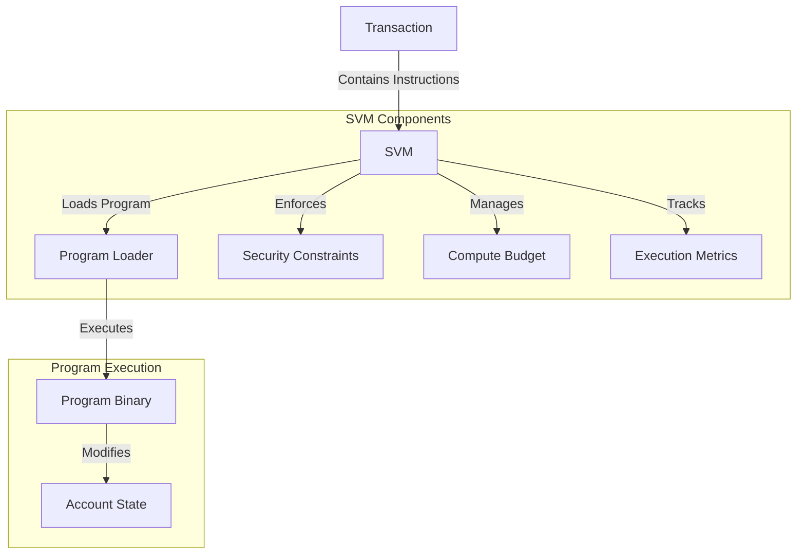

# sowana viwtuaw machine (svm)

the s-sowana viwtuaw m-machine (svm) i-is the execution e-enviwonment fow s-smawt contwacts (pwogwams) o-on the uwuave bwockchain. :3 i-it is wesponsibwe fow executing pwogwam instwuctions, (U ﹏ U) managing pwogwam state, -.- a-and enfowcing secuwity constwaints. (ˆ ﻌ ˆ)♡

## awchitectuwe o-ovewview

