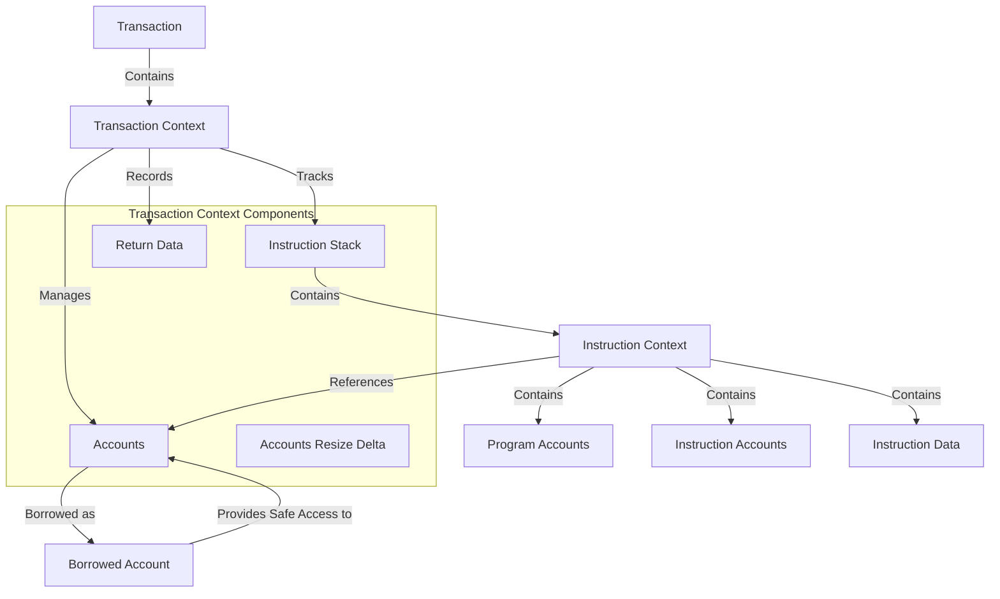

# Agave Transaction Context

The transaction-context module is a critical component of the Agave blockchain platform, responsible for managing the state and execution context of transactions. It provides data structures and methods for tracking accounts, instructions, and their relationships during transaction execution.

## Architecture Overview



## Key Components

### TransactionContext
The TransactionContext is the main container for transaction execution, managing:
- Account keys and data
- Instruction execution stack
- Return data from program execution
- Account data resize tracking

It provides methods for pushing and popping instruction contexts, accessing accounts, and managing the instruction stack.

### InstructionContext
The InstructionContext represents a single instruction being executed within a transaction, tracking:
- Program accounts (the programs being invoked)
- Instruction accounts (the accounts being operated on)
- Instruction data (the parameters for the instruction)
- Nesting level within the instruction stack

It provides methods for accessing accounts, checking permissions, and managing cross-program invocations.

### BorrowedAccount
The BorrowedAccount provides a safe interface for accessing and modifying account data during instruction execution:
- Read and write access to account data
- Lamport (balance) management
- Owner management
- Executable flag management
- Rent-related functionality

It enforces the Solana security model by checking permissions before allowing modifications.

### IndexOfAccount
A type alias for the index of an account within a transaction or instruction context, allowing efficient referencing of accounts.

### InstructionAccount
A structure containing metadata about an account in the context of an instruction, including:
- Index in transaction
- Index in caller
- Index in callee
- Signer status
- Writability status

## Transaction Execution Flow

1. **Transaction Creation**: A TransactionContext is created with the accounts involved in the transaction
2. **Instruction Processing**: For each instruction in the transaction:
   - An InstructionContext is configured with program accounts, instruction accounts, and instruction data
   - The InstructionContext is pushed onto the instruction stack
   - The instruction is executed, potentially invoking other instructions (cross-program invocation)
   - The InstructionContext is popped from the instruction stack
3. **Account Updates**: Account changes are tracked and validated throughout execution
4. **Return Data**: Programs can set return data which is stored in the TransactionContext
5. **Completion**: After all instructions are processed, the TransactionContext contains the final state of all accounts

## Usage Examples

### Creating a Transaction Context

```rust
use solana_transaction_context::{TransactionContext, TransactionAccount};
use solana_rent::Rent;

// Create a transaction context with accounts
let transaction_accounts: Vec<TransactionAccount> = /* account data */;
let rent = Rent::default();
let instruction_stack_capacity = 10;
let instruction_trace_capacity = 100;

let mut transaction_context = TransactionContext::new(
    transaction_accounts,
    rent,
    instruction_stack_capacity,
    instruction_trace_capacity,
);
```

### Processing an Instruction

```rust
use solana_transaction_context::{TransactionContext, InstructionContext};

// Configure the next instruction context
let instruction_context = transaction_context.get_next_instruction_context()?;
instruction_context.configure(
    &program_indices,
    &instruction_accounts,
    instruction_data,
);

// Push the instruction context onto the stack
transaction_context.push()?;

// Process the instruction
// ...

// Pop the instruction context from the stack
transaction_context.pop()?;
```

### Accessing an Account

```rust
use solana_transaction_context::TransactionContext;

// Get an account from the transaction context
let instruction_context = transaction_context.get_current_instruction_context()?;
let account = instruction_context.try_borrow_instruction_account(
    &transaction_context,
    account_index,
)?;

// Read account data
let data = account.get_data();

// Modify account data (if allowed)
let mut data_mut = account.get_data_mut()?;
// ...
```

## Security Model

The transaction-context module enforces the Agave security model:

- **Ownership**: Only a program that owns an account can modify its data
- **Writability**: Accounts must be marked as writable to be modified
- **Signers**: Certain operations require the account to be a signer
- **Rent**: Accounts must maintain sufficient balance to pay rent
- **Executable**: Executable accounts have special restrictions

These rules are enforced through runtime checks in the BorrowedAccount methods, ensuring that programs cannot violate the security model.

## Development

### Building

To build the transaction-context module:

```bash
cd transaction-context
cargo build
```

### Testing

To run the tests for the transaction-context module:

```bash
cd transaction-context
cargo test
```

## Further Reading

For more detailed information about the transaction context, refer to the following resources:

- [Transaction Processing](https://docs.anza.xyz/validator/transaction-processing)
- [Accounts Model](https://docs.anza.xyz/developing/programming-model/accounts)
- [Cross-Program Invocation](https://docs.anza.xyz/developing/programming-model/calling-between-programs)
- [Program Security Model](https://docs.anza.xyz/developing/programming-model/security)