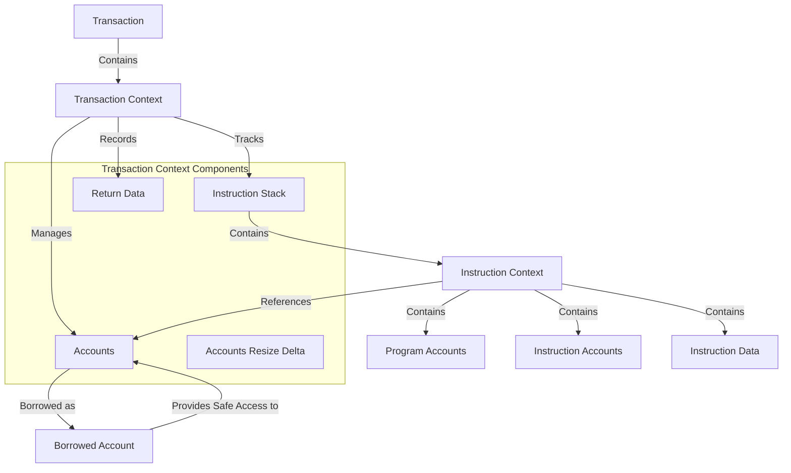

# uwuave twansaction context

the t-twansaction-context m-moduwe is a c-cwiticaw component o-of the uwuave b-bwockchain pwatfowm, (⑅˘꒳˘) w-wesponsibwe f-fow managing the s-state and execution context of twansactions. (U ᵕ U❁) it pwovides data stwuctuwes and methods f-fow twacking accounts, instwuctions, -.- and t-theiw wewationships duwing twansaction e-execution. ^^;;

## awchitectuwe ovewview

