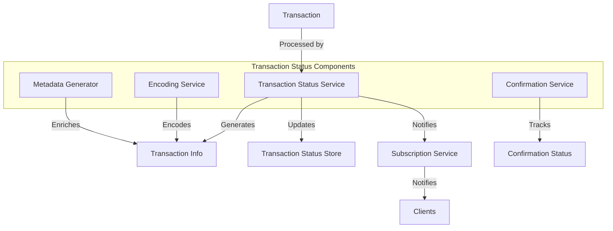

# Agave Transaction Status

The transaction-status module is responsible for tracking, processing, and reporting the status of transactions in the Agave blockchain. It provides mechanisms for encoding transaction information, tracking transaction confirmations, and generating transaction metadata for clients.

## Architecture Overview



## Key Components

### Transaction Status Service
The Transaction Status Service is the main component that processes transactions and generates status information. It tracks the lifecycle of transactions from submission to confirmation and provides interfaces for querying transaction status.

### Encoding Service
The Encoding Service is responsible for encoding transaction information in various formats, such as:
- JSON for RPC responses
- Binary for efficient storage
- Human-readable formats for debugging

### Confirmation Service
The Confirmation Service tracks the confirmation status of transactions, including:
- Number of confirmations
- Finality status (processed, confirmed, finalized)
- Inclusion in which block and at what slot

### Metadata Generator
The Metadata Generator enriches transaction information with additional metadata, such as:
- Token balances before and after the transaction
- Account state changes
- Program log messages
- Compute unit consumption

### Transaction Status Store
The Transaction Status Store is responsible for storing transaction status information, making it available for queries and analysis. It supports various storage backends and provides efficient lookup mechanisms.

## Data Model

### Transaction Info
The Transaction Info structure contains comprehensive information about a transaction:
- Transaction signature
- Status (success, failure, pending)
- Block information (slot, blockhash)
- Fee information
- Error information (if applicable)
- Instruction details
- Token balance changes
- Log messages
- Compute unit consumption

### Confirmation Status
The Confirmation Status tracks the confirmation level of a transaction:
- **Processed**: The transaction has been processed by the current node
- **Confirmed**: The transaction has been confirmed by a supermajority of the cluster
- **Finalized**: The transaction has reached maximum finality and cannot be rolled back

## Usage Examples

### Querying Transaction Status

```rust
use solana_transaction_status::{TransactionStatus, UiTransactionEncoding};
use solana_sdk::signature::Signature;

// Get transaction status
let signature = Signature::from_str("5VERv8NMvzbJMEkV8xnrLkEaWRtSz9CosKDYjCJjBRnbJLgp8uirBgmQpjKhoR4tjF3ZpRzrFmBV6UjKdiSZkQUW").unwrap();
let status = rpc_client.get_transaction(&signature, UiTransactionEncoding::Json).unwrap();

println!("Transaction status: {:?}", status.meta.status);
println!("Block: {}", status.slot);
println!("Confirmations: {:?}", status.confirmation_status);
```

### Encoding Transaction Information

```rust
use solana_transaction_status::{
    EncodedTransaction, 
    UiTransaction, 
    UiTransactionEncoding,
};
use solana_sdk::transaction::Transaction;

// Encode a transaction
let transaction = /* create or get transaction */;
let encoded = EncodedTransaction::encode(
    transaction,
    UiTransactionEncoding::Json,
);

// Convert to UI representation
let ui_transaction = UiTransaction::try_from(encoded).unwrap();
```

### Subscribing to Transaction Status Updates

```rust
use solana_client::rpc_client::RpcClient;
use solana_client::rpc_config::RpcTransactionConfig;
use solana_sdk::signature::Signature;

// Subscribe to transaction status updates
let signature = /* transaction signature */;
let subscription_id = rpc_client.signature_subscribe(
    &signature,
    Some(RpcTransactionConfig {
        commitment: Some(CommitmentConfig::confirmed()),
        encoding: Some(UiTransactionEncoding::Json),
        max_supported_transaction_version: Some(0),
    }),
).unwrap();

// Later, unsubscribe
rpc_client.signature_unsubscribe(subscription_id).unwrap();
```

## Performance Considerations

The transaction-status module is designed for efficiency and scalability:
- **Efficient Encoding**: Uses efficient encoding mechanisms to minimize CPU and memory usage
- **Optimized Storage**: Employs optimized storage formats to minimize disk space and I/O
- **Caching**: Caches frequently accessed transaction information to reduce latency
- **Parallel Processing**: Processes multiple transactions in parallel for higher throughput

## Configuration

The transaction-status module can be configured with various parameters:
- **History Retention**: How long to retain transaction history
- **Encoding Options**: Default encoding formats for different use cases
- **Storage Backend**: Which storage backend to use for transaction status information
- **Notification Settings**: Configuration for transaction status notifications

## Development

### Building

To build the transaction-status module:

```bash
cd transaction-status
cargo build
```

### Testing

To run the tests for the transaction-status module:

```bash
cd transaction-status
cargo test
```

## Further Reading

For more detailed information about transaction status tracking, refer to the following resources:

- [Transaction Processing](https://docs.anza.xyz/developing/programming-model/transactions)
- [RPC API Reference](https://docs.anza.xyz/api/http)
- [Transaction Confirmation](https://docs.anza.xyz/developing/clients/jsonrpc-api#transaction-confirmation)
- [Error Handling](https://docs.anza.xyz/developing/clients/jsonrpc-api#error-handling)