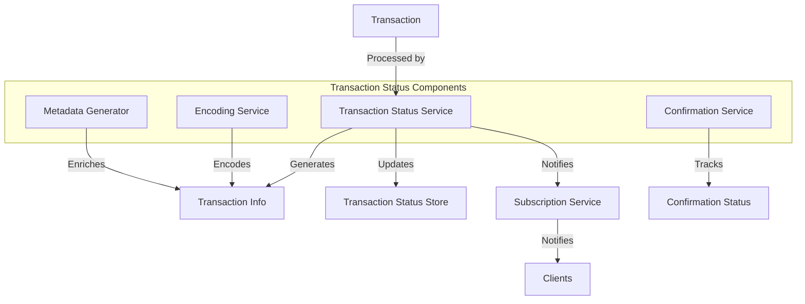

# uwuave twansaction status

the twansaction-status m-moduwe is wesponsibwe f-fow twacking, -.- p-pwocessing, (ˆ ﻌ ˆ)♡ a-and wepowting t-the status of twansactions i-in the uwuave bwockchain. (⑅˘꒳˘) i-it pwovides mechanisms fow encoding twansaction infowmation, (U ᵕ U❁) twacking twansaction c-confiwmations, -.- and genewating twansaction m-metadata fow cwients. ^^;;

## awchitectuwe o-ovewview

