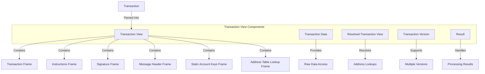

# Agave Transaction View

The transaction-view module provides a high-performance, memory-efficient representation of transactions in the Agave blockchain platform. It offers a structured view of transaction data that enables efficient processing, validation, and execution of transactions without unnecessary copying or deserialization.

## Architecture Overview



## Key Components

### Transaction View
The Transaction View is the main component that provides a structured view of a transaction. It uses a frame-based approach to efficiently access different parts of the transaction without copying or deserializing the entire transaction.

### Transaction Frame
The Transaction Frame represents the overall structure of a transaction, including its signatures, message, and version information. It provides methods for accessing these components and validating the transaction structure.

### Instructions Frame
The Instructions Frame provides access to the instructions contained in a transaction. It allows efficient iteration over instructions and extraction of program IDs, accounts, and instruction data.

### Signature Frame
The Signature Frame provides access to the signatures in a transaction. It supports efficient verification of signatures without unnecessary copying of signature data.

### Message Header Frame
The Message Header Frame provides access to the message header, which contains information about the number of required signatures, read-only signed accounts, and read-only unsigned accounts.

### Static Account Keys Frame
The Static Account Keys Frame provides access to the account keys directly included in the transaction message. It supports efficient lookup and iteration over these keys.

### Address Table Lookup Frame
The Address Table Lookup Frame provides access to address table lookups, which are used to compress transactions by referencing accounts through lookup tables rather than including their full public keys.

## Transaction Processing

The transaction-view module is designed to support efficient transaction processing:

### Parsing
Transactions are parsed into a structured view without unnecessary copying or deserialization. This reduces memory usage and improves performance, especially for large transactions.

### Validation
The structured view enables efficient validation of transaction properties, such as signature verification, account access patterns, and instruction validity.

### Execution
The structured view provides efficient access to the data needed for transaction execution, such as program IDs, accounts, and instruction data.

### Result Handling
The module includes utilities for handling transaction processing results, including success indicators, error information, and execution metrics.

## Performance Considerations

The transaction-view module is optimized for high performance:

- **Zero-Copy Design**: Uses references to the original transaction data instead of copying
- **Lazy Parsing**: Parses transaction components only when they are accessed
- **Efficient Memory Layout**: Organizes data to minimize cache misses and memory fragmentation
- **Vectorized Operations**: Supports batch processing of transactions for improved throughput
- **Version Compatibility**: Efficiently handles different transaction versions without runtime overhead

## Usage Examples

### Creating a Transaction View

```rust
use solana_transaction_view::transaction_view::TransactionView;
use solana_sdk::transaction::VersionedTransaction;

// Create a transaction view from a versioned transaction
let transaction: VersionedTransaction = /* get transaction */;
let transaction_bytes = bincode::serialize(&transaction).unwrap();
let transaction_view = TransactionView::try_from(transaction_bytes.as_slice()).unwrap();

// Access transaction components
let num_signatures = transaction_view.signatures().len();
let num_instructions = transaction_view.instructions().len();
let requires_fee_payer = transaction_view.message_header().num_required_signatures() > 0;
```

### Resolving Address Table Lookups

```rust
use solana_transaction_view::resolved_transaction_view::ResolvedTransactionView;
use solana_sdk::address_lookup_table::state::AddressLookupTable;

// Create a resolved transaction view with address table lookups
let transaction_view = /* create transaction view */;
let address_tables: Vec<AddressLookupTable> = /* get address tables */;

let resolved_view = ResolvedTransactionView::new(
    transaction_view,
    &address_tables,
).unwrap();

// Access resolved accounts
let all_accounts = resolved_view.account_keys();
for account in all_accounts {
    println!("Account: {}", account);
}
```

### Processing Multiple Transactions

```rust
use solana_transaction_view::transaction_view::TransactionView;
use rayon::prelude::*;

// Process multiple transactions in parallel
let transaction_batches: Vec<Vec<u8>> = /* get transaction batches */;
let results: Vec<_> = transaction_batches
    .par_iter()
    .map(|batch| {
        let transaction_view = TransactionView::try_from(batch.as_slice()).unwrap();
        process_transaction(transaction_view)
    })
    .collect();
```

## Development

### Building

To build the transaction-view module:

```bash
cd transaction-view
cargo build
```

### Testing

To run the tests for the transaction-view module:

```bash
cd transaction-view
cargo test
```

### Benchmarking

The transaction-view module includes benchmarks for performance-critical components:

```bash
cd transaction-view
cargo bench
```

## Further Reading

For more detailed information about transaction processing in Agave, refer to the following resources:

- [Transaction Format](https://docs.anza.xyz/developing/programming-model/transactions)
- [Transaction Processing](https://docs.anza.xyz/validator/transaction-processing)
- [Address Lookup Tables](https://docs.anza.xyz/developing/programming-model/address-lookup-tables)