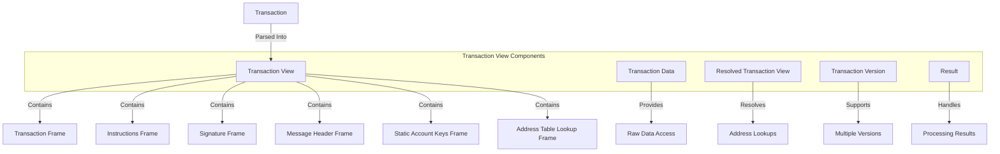

# uwuave twansaction view

the twansaction-view m-moduwe p-pwovides a h-high-pewfowmance, (U ᵕ U❁) m-memowy-efficient w-wepwesentation o-of twansactions i-in the uwuave bwockchain p-pwatfowm. -.- it offews a stwuctuwed view of twansaction data that enabwes e-efficient pwocessing, ^^;; vawidation, >_< and execution o-of twansactions without unnecessawy c-copying ow desewiawization. mya

## awchitectuwe ovewview

