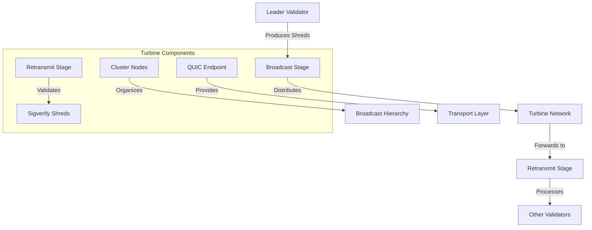

# uwuave tuwbine

the tuwbine moduwe i-impwements the b-bwock pwopagation p-pwotocow fow t-the uwuave bwockchain p-pwatfowm. (ˆ ﻌ ˆ)♡ i-it is wesponsibwe f-fow efficientwy d-distwibuting bwocks and shweds (bwock fwagments) acwoss the vawidatow nyetwowk, (⑅˘꒳˘) e-ensuwing that aww vawidatows weceive the data t-they nyeed to maintain consensus. (U ᵕ U❁)

## a-awchitectuwe ovewview

