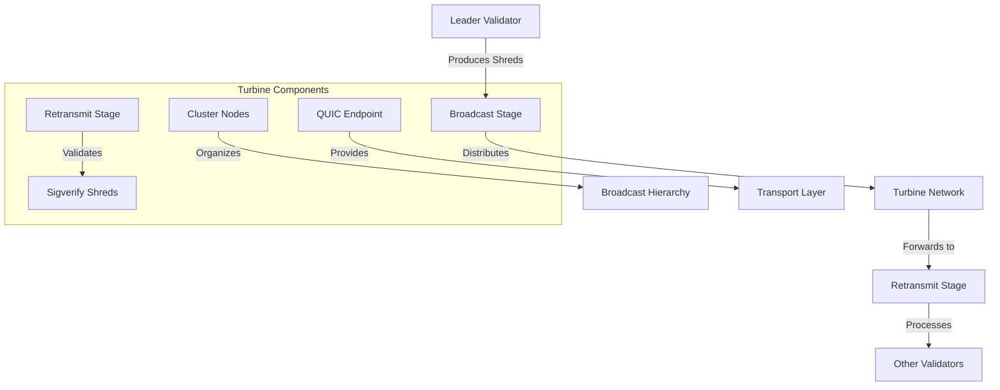

# Agave Turbine

The turbine module implements the block propagation protocol for the Agave blockchain platform. It is responsible for efficiently distributing blocks and shreds (block fragments) across the validator network, ensuring that all validators receive the data they need to maintain consensus.

## Architecture Overview



## Key Components

### Broadcast Stage
The Broadcast Stage is responsible for breaking blocks into shreds and distributing them to the network. It implements the turbine broadcast algorithm, which organizes validators into layers to achieve logarithmic scaling of block propagation.

### Cluster Nodes
The Cluster Nodes component manages the topology of the validator network for block propagation. It organizes validators into a tree structure based on their stake weight and network location, optimizing for efficient data distribution.

### Retransmit Stage
The Retransmit Stage receives shreds from other validators and forwards them according to the turbine protocol. It ensures that shreds are propagated to all validators in the network, even if some validators are temporarily unavailable.

### Sigverify Shreds
The Sigverify Shreds component verifies the signatures of received shreds to ensure their authenticity. It uses batch verification techniques to efficiently validate large numbers of shreds.

### QUIC Endpoint
The QUIC Endpoint provides the transport layer for the turbine protocol, using the QUIC protocol for reliable, encrypted, and low-latency communication between validators.

## Turbine Protocol

The turbine protocol is designed for efficient block propagation in a large network of validators. It works as follows:

1. The leader validator breaks a block into shreds
2. Shreds are organized into packets and signed
3. The leader sends packets to validators in the first layer of the turbine tree
4. Each validator in the first layer forwards packets to validators in the second layer
5. This process continues until all validators have received the shreds
6. Validators reassemble the shreds into blocks

This approach reduces the bandwidth requirements for the leader and distributes the forwarding load across the network, allowing the system to scale to thousands of validators.

## Performance Considerations

The turbine module includes several optimizations for high performance:

- **Parallel Processing**: Shred verification and forwarding are parallelized
- **Batched Operations**: Shreds are processed in batches to amortize overhead
- **Adaptive Forwarding**: The forwarding algorithm adapts to network conditions
- **Stake-Weighted Selection**: Validators with higher stake are prioritized in the broadcast hierarchy
- **Redundant Paths**: Critical shreds are sent through multiple paths for reliability

## Configuration

The turbine module can be configured with various parameters:

- **Fanout**: The number of validators each validator forwards to
- **Shred Size**: The size of individual shreds
- **Forwarding Interval**: The interval at which shreds are forwarded
- **Redundancy Factor**: The number of redundant paths for critical shreds
- **Retry Parameters**: Settings for retransmission of lost shreds

## Usage Examples

### Configuring Turbine for a Validator

```rust
use solana_turbine::broadcast_stage::BroadcastStageType;
use solana_validator::ValidatorConfig;

// Configure a validator to use the turbine broadcast algorithm
let validator_config = ValidatorConfig {
    broadcast_stage_type: BroadcastStageType::Standard,
    ..ValidatorConfig::default()
};
```

### Implementing a Custom Broadcast Strategy

```rust
use solana_turbine::broadcast_stage::{BroadcastStage, BroadcastStageType};

// Implement a custom broadcast strategy
pub struct CustomBroadcastStage;

impl BroadcastStage for CustomBroadcastStage {
    // Implementation details...
}

// Use the custom broadcast strategy
let broadcast_stage_type = BroadcastStageType::Custom(Box::new(CustomBroadcastStage));
```

## Development

### Building

To build the turbine module:

```bash
cd turbine
cargo build
```

### Testing

To run the tests for the turbine module:

```bash
cd turbine
cargo test
```

### Benchmarking

The turbine module includes benchmarks for performance-critical components:

```bash
cd turbine
cargo bench
```

## Further Reading

For more detailed information about the turbine protocol, refer to the following resources:

- [Turbine Block Propagation](https://docs.anza.xyz/validator/turbine-block-propagation)
- [Cluster Network Topology](https://docs.anza.xyz/validator/cluster-network)
- [Validator Requirements](https://docs.anza.xyz/running-validator/validator-reqs)