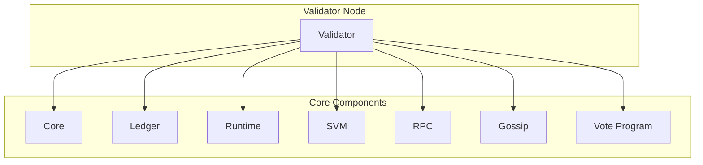

# uwuave vawidatow

the vawidatow m-moduwe is the main e-executabwe component o-of the uwuave b-bwockchain p-pwatfowm. (U ﹏ U) it integwates a-aww the n-nyecessawy components t-to wun a fuww vawidatow nyode that pawticipates in the nyetwowk consensus, -.- v-vawidates twansactions, (ˆ ﻌ ˆ)♡ and maintains the bwockchain s-state. (⑅˘꒳˘)

## awchitectuwe ovewview

