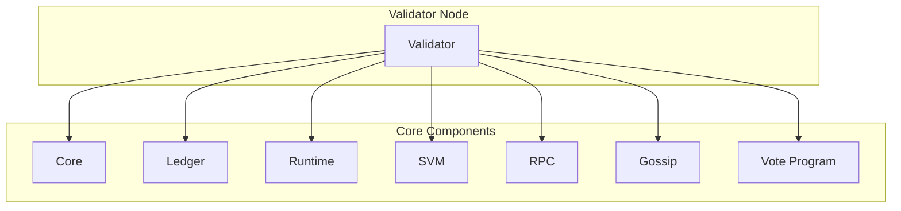

# Agave Validator

The validator module is the main executable component of the Agave blockchain platform. It integrates all the necessary components to run a full validator node that participates in the network consensus, validates transactions, and maintains the blockchain state.

## Architecture Overview



## Key Components

### Validator Process
The main validator process orchestrates all the components needed to run a validator node. It initializes the necessary services, manages their lifecycle, and handles graceful shutdown.

### Configuration
The validator supports various configuration options that can be specified via command-line arguments or a configuration file. These options control aspects such as network participation, resource allocation, and logging.

### Plugin System
The validator includes a plugin system that allows for extending its functionality. Plugins can be used for various purposes, such as custom transaction processing, monitoring, or integration with external systems.

## Validator Roles

Validators in the Agave network can serve different roles:

### Leader
A leader validator is responsible for producing new blocks. The leader is selected based on the Proof of Stake consensus mechanism, which takes into account factors such as stake amount and voting history.

### Validator
A regular validator validates blocks produced by the leader. It verifies that the blocks follow the consensus rules and votes on their validity.

### RPC Node
A validator can also serve as an RPC node, providing an API for clients to interact with the blockchain. This role is optional and can be enabled or disabled via configuration.

## Running a Validator

### Prerequisites
- A machine with sufficient hardware resources (CPU, RAM, disk space, network bandwidth)
- The Agave validator software
- A keypair for the validator identity
- Sufficient SOL tokens for staking (if participating in consensus)

### Basic Setup

1. Generate a validator identity:
   ```bash
   agave-keygen new -o validator-keypair.json
   ```

2. Start the validator:
   ```bash
   agave-validator \
     --identity validator-keypair.json \
     --ledger /path/to/ledger \
     --rpc-port 8899 \
     --entrypoint entrypoint.mainnet-beta.solana.com:8001 \
     --expected-genesis-hash <GENESIS_HASH> \
     --limit-ledger-size
   ```

### Advanced Configuration

The validator supports numerous configuration options for fine-tuning its behavior. Some notable options include:

- `--accounts`: Specify the directory for storing account data
- `--gossip-port`: Specify the port for the gossip service
- `--dynamic-port-range`: Specify the range of ports to use for various services
- `--log`: Configure logging level and destination
- `--limit-ledger-size`: Limit the size of the ledger to conserve disk space
- `--private-rpc`: Disable public RPC access
- `--no-voting`: Run the validator without participating in consensus

For a complete list of options, run:
```bash
agave-validator --help
```

## Monitoring

The validator provides various metrics and logs that can be used for monitoring its health and performance:

- **Logs**: The validator outputs logs that provide information about its operation
- **Metrics**: The validator can export metrics in Prometheus format
- **Dashboard**: The metrics can be visualized using tools like Grafana

## Troubleshooting

Common issues and their solutions:

- **Validator not syncing**: Check network connectivity, ensure the entrypoint is correct
- **High CPU/memory usage**: Adjust resource limits, consider upgrading hardware
- **Disk space issues**: Use `--limit-ledger-size`, consider pruning old data
- **RPC errors**: Check RPC configuration, ensure sufficient resources

## Development

### Building

To build the validator:

```bash
cd validator
cargo build
```

For a release build:

```bash
cd validator
cargo build --release
```

### Testing

To run the tests:

```bash
cd validator
cargo test
```

## Further Reading

For more detailed information about running a validator, refer to the following resources:

- [Validator Requirements](https://docs.anza.xyz/running-validator/validator-reqs)
- [Validator Setup Guide](https://docs.anza.xyz/running-validator/validator-start)
- [Validator Monitoring](https://docs.anza.xyz/running-validator/validator-monitor)
- [Validator Troubleshooting](https://docs.anza.xyz/running-validator/validator-troubleshoot)