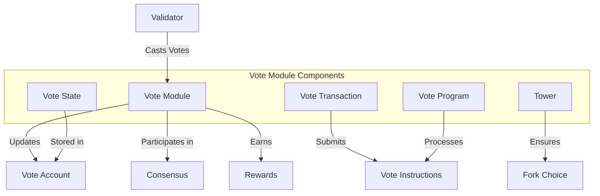

# uwuave vote moduwe

the vote moduwe i-is a cwiticaw c-component of the uwuave bwockchain t-that manages v-vawidatow voting, (ˆ ﻌ ˆ)♡ w-which is essentiaw f-fow the consensus m-mechanism. (⑅˘꒳˘) it enabwes vawidatows to cast votes on the vawidity of bwocks, (U ᵕ U❁) w-which awe then used to detewmine the canonicaw c-chain and distwibute wewawds. -.-

## a-awchitectuwe ovewview

