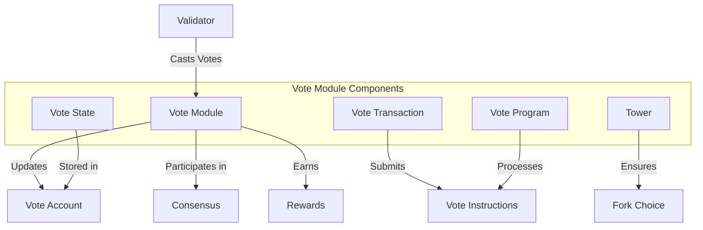

# Agave Vote Module

The vote module is a critical component of the Agave blockchain that manages validator voting, which is essential for the consensus mechanism. It enables validators to cast votes on the validity of blocks, which are then used to determine the canonical chain and distribute rewards.

## Architecture Overview



## Key Components

### Vote State
The Vote State component maintains the state of a validator's votes, including:
- Vote history
- Root slot
- Credits and commission
- Authorized voters and withdrawers
- Node identity

### Vote Transaction
The Vote Transaction component creates and submits vote transactions, which include:
- The slot being voted on
- The hash of the block being voted on
- The previous votes in the validator's history

### Tower
The Tower component implements the fork choice algorithm, which determines which fork of the blockchain a validator should build upon. It ensures that validators follow the "heaviest" fork according to stake-weighted votes.

### Vote Program
The Vote Program is an on-chain program that processes vote instructions and updates vote accounts. It enforces the rules of voting, such as:
- Only authorized voters can vote
- Votes must be for slots greater than previously voted slots
- Only authorized withdrawers can withdraw rewards

## Vote Account

A vote account contains the following information:
- **Node Identity**: The identity of the validator node
- **Authorized Voter**: The public key authorized to sign votes
- **Authorized Withdrawer**: The public key authorized to withdraw rewards
- **Commission**: The percentage of rewards that go to the validator
- **Votes**: The history of votes cast by the validator
- **Root Slot**: The highest confirmed root
- **Credits**: The total credits earned by the validator
- **Last Timestamp**: The timestamp of the last vote
- **Epoch Credits**: Credits earned per epoch

## Voting Process

1. **Block Production**: A leader validator produces a block
2. **Block Verification**: Other validators verify the block
3. **Vote Creation**: Validators create vote transactions for valid blocks
4. **Vote Submission**: Validators submit vote transactions to the network
5. **Vote Processing**: The Vote Program processes vote transactions and updates vote accounts
6. **Consensus**: The network reaches consensus based on stake-weighted votes
7. **Rewards**: Validators earn rewards based on their voting activity

## Usage Examples

### Creating a Vote Account

```rust
use solana_sdk::{
    signature::{Keypair, Signer},
    transaction::Transaction,
};
use solana_vote_program::{
    vote_instruction,
    vote_state::VoteInit,
};

// Generate keypairs
let node_keypair = Keypair::new();
let vote_keypair = Keypair::new();
let authorized_voter = vote_keypair.pubkey();
let authorized_withdrawer = vote_keypair.pubkey();

// Create vote account
let commission = 10; // 10%
let vote_init = VoteInit {
    node_pubkey: node_keypair.pubkey(),
    authorized_voter,
    authorized_withdrawer,
    commission,
};

let instruction = vote_instruction::create_account(
    &payer.pubkey(),
    &vote_keypair.pubkey(),
    &vote_init,
    lamports,
);

let transaction = Transaction::new_signed_with_payer(
    &[instruction],
    Some(&payer.pubkey()),
    &[&payer, &vote_keypair],
    recent_blockhash,
);
```

### Casting a Vote

```rust
use solana_sdk::{
    signature::{Keypair, Signer},
    transaction::Transaction,
};
use solana_vote_program::{
    vote_instruction,
    vote_state::{Vote, VoteTransaction},
};

// Create a vote
let vote = Vote {
    slots: vec![slot],
    hash: blockhash,
    timestamp: Some(timestamp),
};

// Create vote transaction
let vote_ix = vote_instruction::vote(
    &vote_keypair.pubkey(),
    &authorized_voter.pubkey(),
    vote,
);

let transaction = Transaction::new_signed_with_payer(
    &[vote_ix],
    Some(&payer.pubkey()),
    &[&payer, &authorized_voter],
    recent_blockhash,
);
```

### Updating Vote Account Authority

```rust
use solana_sdk::{
    signature::{Keypair, Signer},
    transaction::Transaction,
};
use solana_vote_program::{
    vote_instruction,
    vote_state::VoteAuthorize,
};

// Update authorized voter
let new_authorized_voter = Keypair::new();
let vote_authorize = VoteAuthorize::Voter;

let instruction = vote_instruction::authorize(
    &vote_keypair.pubkey(),
    &authorized_withdrawer.pubkey(),
    &new_authorized_voter.pubkey(),
    vote_authorize,
);

let transaction = Transaction::new_signed_with_payer(
    &[instruction],
    Some(&payer.pubkey()),
    &[&payer, &authorized_withdrawer],
    recent_blockhash,
);
```

## Performance Considerations

The vote module is designed for efficiency and reliability:
- **Optimized Vote Transactions**: Vote transactions are kept as small as possible
- **Parallel Processing**: Votes can be processed in parallel with other transactions
- **Caching**: Vote states are cached to minimize storage access
- **Batching**: Multiple votes can be batched into a single transaction

## Configuration

The vote module can be configured with various parameters:
- **Max Vote History Length**: The maximum number of votes to store in the vote history
- **Commission**: The percentage of rewards that go to the validator
- **Vote Signing Scheme**: The cryptographic scheme used to sign votes

## Development

### Building

To build the vote module:

```bash
cd vote
cargo build
```

### Testing

To run the tests for the vote module:

```bash
cd vote
cargo test
```

## Further Reading

For more detailed information about the vote module, refer to the following resources:

- [Consensus Mechanism](https://docs.anza.xyz/validator/vote-signing)
- [Staking and Delegation](https://docs.anza.xyz/staking/stake-accounts)
- [Validator Rewards](https://docs.anza.xyz/economics/staking-rewards)
- [Tower BFT](https://docs.anza.xyz/implemented-proposals/tower-bft)