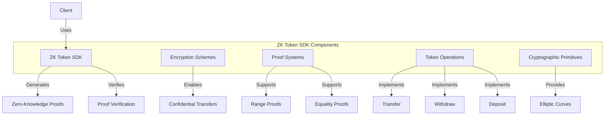

# Agave ZK Token SDK

The zk-token-sdk module provides zero-knowledge proof functionality for privacy-preserving token operations on the Agave blockchain. It enables confidential transfers, shielded staking, and other privacy-enhancing features while maintaining the security and auditability of the blockchain.

## Architecture Overview



## Key Components

### Encryption Schemes
The ZK Token SDK supports various encryption schemes for confidential token operations:
- **ElGamal Encryption**: A public-key encryption scheme used for confidential token amounts
- **Pedersen Commitments**: A commitment scheme that allows hiding values while preserving the ability to prove properties about them

### Proof Systems
The SDK includes several zero-knowledge proof systems:
- **Bulletproofs**: Efficient non-interactive zero-knowledge proofs for range proofs
- **Sigma Proofs**: Efficient proofs for various relations between encrypted values
- **PLONK**: A universal SNARK (Succinct Non-interactive Argument of Knowledge) for complex statements

### Token Operations
The SDK implements privacy-preserving versions of common token operations:
- **Transfer**: Confidential transfer of tokens between accounts
- **Withdraw**: Convert confidential tokens to public tokens
- **Deposit**: Convert public tokens to confidential tokens
- **Split**: Split a confidential amount into multiple outputs
- **Combine**: Combine multiple confidential amounts into a single output

### Cryptographic Primitives
The SDK provides various cryptographic primitives:
- **Elliptic Curves**: Implementation of elliptic curve operations
- **Hash Functions**: Cryptographic hash functions optimized for zero-knowledge proofs
- **Random Number Generation**: Secure random number generation for cryptographic operations

## Usage Examples

### Creating a Confidential Transfer

```rust
use solana_zk_token_sdk::{
    encryption::{elgamal::ElGamalKeypair, pedersen::Pedersen},
    zk_token_proof_instruction,
    zk_token_elgamal::pod,
};
use solana_sdk::{pubkey::Pubkey, signature::Signer, transaction::Transaction};

// Generate sender and recipient keypairs
let sender_elgamal_keypair = ElGamalKeypair::new_rand();
let recipient_elgamal_keypair = ElGamalKeypair::new_rand();

// Create a confidential transfer
let amount = 100;
let sender_ciphertext = /* get sender's current ciphertext */;
let transfer_amount_ciphertext = sender_elgamal_keypair.public.encrypt(amount);

// Generate proofs
let proof_data = zk_token_proof_instruction::transfer::TransferData::new(
    sender_elgamal_keypair,
    recipient_elgamal_keypair.public,
    sender_ciphertext,
    transfer_amount_ciphertext,
    amount,
).unwrap();

// Create instruction
let instruction = zk_token_proof_instruction::transfer(
    program_id,
    sender_account,
    recipient_account,
    proof_data,
);

// Build and send transaction
let transaction = Transaction::new_signed_with_payer(
    &[instruction],
    Some(&payer.pubkey()),
    &[&payer],
    recent_blockhash,
);
```

### Verifying a Zero-Knowledge Proof

```rust
use solana_zk_token_sdk::{
    zk_token_proof_program::processor::process_instruction,
    zk_token_proof_instruction::verify_transfer,
};

// Verify a transfer proof
let result = process_instruction(
    program_id,
    &accounts,
    &instruction_data,
);

if result.is_ok() {
    println!("Proof verification successful");
} else {
    println!("Proof verification failed");
}
```

### Creating a Range Proof

```rust
use solana_zk_token_sdk::{
    encryption::{elgamal::ElGamalKeypair, pedersen::Pedersen},
    range_proof::RangeProof,
};

// Generate a keypair
let elgamal_keypair = ElGamalKeypair::new_rand();

// Create a range proof for a value
let amount = 50;
let ciphertext = elgamal_keypair.public.encrypt(amount);
let range_proof = RangeProof::new(
    amount,
    &elgamal_keypair,
    ciphertext,
    32, // bit length
);

// Verify the range proof
let valid = range_proof.verify(
    &elgamal_keypair.public,
    ciphertext,
    32, // bit length
);

assert!(valid);
```

## Performance Considerations

The ZK Token SDK is designed for efficiency and usability:
- **Optimized Cryptography**: Uses optimized implementations of cryptographic primitives
- **Proof Aggregation**: Supports aggregating multiple proofs to reduce verification cost
- **Batched Verification**: Enables verifying multiple proofs in a single operation
- **Hardware Acceleration**: Takes advantage of hardware acceleration when available

## Security Considerations

The ZK Token SDK prioritizes security:
- **Formal Verification**: Key components have been formally verified
- **Side-Channel Resistance**: Implementations are designed to resist side-channel attacks
- **Constant-Time Operations**: Cryptographic operations are implemented in constant time
- **Secure Randomness**: Uses secure random number generation for all operations

## Development

### Building

To build the zk-token-sdk module:

```bash
cd zk-token-sdk
cargo build
```

### Testing

To run the tests for the zk-token-sdk module:

```bash
cd zk-token-sdk
cargo test
```

### Benchmarking

The zk-token-sdk module includes benchmarks for performance-critical components:

```bash
cd zk-token-sdk
cargo bench
```

## Further Reading

For more detailed information about the ZK Token SDK, refer to the following resources:

- [Zero-Knowledge Proofs Overview](https://docs.anza.xyz/developing/zk-token-sdk/overview)
- [Confidential Transfers](https://docs.anza.xyz/developing/zk-token-sdk/confidential-transfers)
- [Proof Systems](https://docs.anza.xyz/developing/zk-token-sdk/proof-systems)
- [Security Considerations](https://docs.anza.xyz/developing/zk-token-sdk/security)