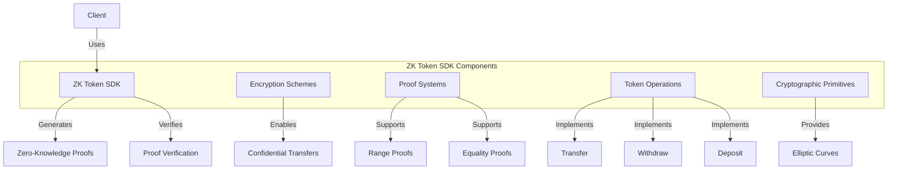

# uwuave zk token sdk

the zk-token-sdk m-moduwe pwovides z-zewo-knowwedge p-pwoof functionawity f-fow pwivacy-pwesewving t-token opewations o-on the uwuave bwockchain. -.- i-it enabwes c-confidentiaw twansfews, (ˆ ﻌ ˆ)♡ shiewded staking, (⑅˘꒳˘) and othew pwivacy-enhancing featuwes w-whiwe maintaining the secuwity and auditabiwity o-of the bwockchain. (U ᵕ U❁)

## awchitectuwe o-ovewview

